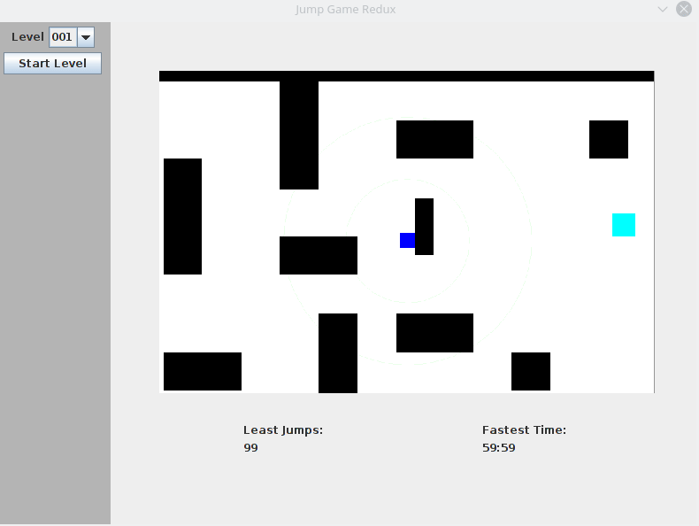

# JumpGameRedux

In Jump Game, the player controls a square centered on the screen. The square usually just follows the laws of gravity (besides sticking to walls), but after the user clicks somewhere the square is launched toward the point of mouse, with a velocity proportional to the distance of contact. Tapping space resets to the begining of the level. Double tapping space quits the level. I'm going to put this information inside the game later.

This is a remake of a game I made in 2014.

This code is cleaner, and more organized. Structure influenced by the Model-View pattern.

Spacebar to reset. Click to jump. The player is dark blue, the finish is cyan, and the walls are black.

### Building

Clone the repository and run `mvn compile  exec:java -Dexec.mainClass="main.Main"`

To create a jar use `mvn clean package` and then `java -jar target/jumpgameswing-*.jar`
